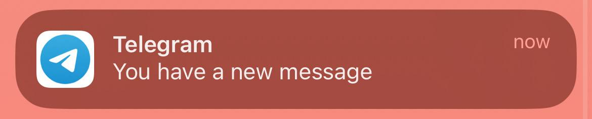

We share so many private texts and photos nowadays. How can we be sure that no one else on the internet can access them? They must be stored *somewhere*, right?

The security and privacy of your chats varies a lot with what platform you use. The most important aspect is that it is *end-to-end* encrypted (E2EE), which means only the person you're texting can actually decipher your messages. I won't get too deep into the technical details, but it basically means that you produce a key (private key) and a lock (public key) pair. Your friend protects a message with the lock you gave them, and only you have the key to open it - no servers anywhere have it, just you on your device.

If anyone intercepts the message, or accesses the database where it is stored, it just seems like gibberish because it is encrypted and they cannot decrypt it.

Note, however, that if a chat is not E2EE it does not mean it is unencrypted. It usually means it is server-side encrypted, and therefore what is stored in the database is still gibberish. If a random person accesses the database, they cannot read your messages. In practical terms, this means that employees who work on the platform *and* have access to the decryption key can decode and read your messages in plain text. This *does not* mean that  the whole company has these accesses, or that one key decrypts all messages for all users. But it is still considerably less safe than the E2EE approach.

If the app does not have E2EE it also means that governments or other organizations can make deals with the company in order to decrypt and read your messages. If you know what Chat Control is, you can probably see where I'm headed here, right? But more on that later.

Let's break it down per platform.

## WhatsApp (Meta)

Probably one of the most used platforms. At least I cannot get rid of it no matter how much I try, always with a new group popping up.

It is advertised as being end-to-end encrypted so yey ✅
For both texts and calls.

Maybe you remember that at some point you could only use WhatsApp on your pc when you had it turned on on your phone? It used to have a particular system though, where it used your phone as a primary device and it is where the messages are always decrypted. If you had WhatsApp on your computer, the data was synched there so it always passed by your phone first. So this absurd system where you could not turn off your phone happened to protect your data and keep E2EE (and also because WhatsApp needs you to store your messages locally). Of course this can be implemented without this impractical system, which is how it works now.

One thing I personally dislike about WhatsApp is its inability to store past conversations in the cloud. I need to decide when to back it up? And the prompt keeps popping up? Just do that for me, please. If no one can decrypt it, it should be fine to store it somewhere other than my phone. But storage is expensive so I get it.

## Facebook Messenger (Meta)

It also has E2EE encryption ✅

Since 2024, as you can see the beginning of the rollout [here](https://about.fb.com/news/2024/03/end-to-end-encryption-on-messenger-explained/).

In any case you can always check if your chats are E2EE when you open them and click on the person. It actually says "🔒 End-to-end encrypted".

Note that this rollout is somewhat new, so before 2024 there was just server-side encryption (if anything). I am not sure how old messages are stored on their servers. Are they still using the server key to encrypt and decrypt it? Maybe only the new messages have end-to-end encryption. I would trust that this is the case, because a data migration of this size, can take quite some time, and they might just opt to not do it. But that information is not public.

It seems like the same thing applies for group chats so keep that in mind.

## Instagram (Meta)

It is *not* E2EE for calls or video. 🚫

It is a social media platform. It is not really made for texting, or to keep private things private. It is easy to communicate through here but please keep this in mind!

## Telegram

I love Telegram's UI and the fact that all the features it has are then copied by WhatsApp but poorly.

So it really pains me to say this but the default chats in Telegram are *not* end-to-end encrypted 🚫 Or at least by default.

The calls are and always have been E2EE so yey? ✅

There is at least the option to have *secret chats* where it is enabled. It is just not enabled by default. But then it is a pain because you can't preview the messages. If you get a message in a secret chat, this is the notification you see:

  

So no information on the sender and no way to read it before you want to click and commit to answering.

But then you have all the features of Telegram that you don't in WhatsApp: scheduling messages, disappearing messages, properly deleting and editing messages, and most of all: not belonging to Meta.

There have been claims that this messaging system has ties with Russia's Federal Security Service, since it is a Russian-made app. But it was also an app that survived the supposed blocks by the Russian government during several pro-democracy movements such as the one in Belarus back in 2020 (more on that [here](https://www.newsweek.com/telegram-messenger-russia-fsb-ties-report-2083491)). So it is understandable if you don't want to use Telegram because you are suspicious of how your data is actually processed, even for supposedly secret chats.

## Signal

I guess we all expect what this one is, as it is their major claim:

Yes, Signal is E2EE for all messages and calls ✅

It does not have such a wide fan base nor a lot of features but the UI is friendly enough and it does seem like one of the safest options.

It has a similar storage situation to WhatsApp where the messages are stored mostly on your device. However, now you can opt in to 45 days of message storing, or more if you pay for it, as was announced just this month! Blog post [here](https://signal.org/blog/introducing-secure-backups/).

It seems like Signal is evolving in the right direction, just not at a very fast pace.

## Snapchat

Snapchat is an interesting one.

For the snaps and videos: Yes, it is E2EE  ✅

For the texts and calls: Nope! 🚫

So if you're just sending spicy photos, looks like it's all safe but maybe there are safer platforms for proper conversations.

There are also [some claims](https://www.reddit.com/r/cybersecurity/comments/19egybd/isnt_snapchat_endtoend_encrypted/) over about the uncertain security of Snapchat traffic, but one cannot be sure that it was actually a Snapchat feature, or a bug, or just a guy that had malware installed.

## Discord

It is E2EE for calls and video ✅

But not for texts 🚫

I guess it makes sense in a way, the focus of this app is not really text-communication. It is better to invest in proper security for calls. But I think we'd all be better off if they implemented it for messages too.

## Summary

There are a lot of factors to take into account when choosing your preferred messaging app. I vote to always opt for the safest one but, of course, the UI and how many people are actually using it also matters.

| Platform | E2EE for texts | E2EE for calls|
| -------- | ------- | ------- |
| WhatsApp (Meta) | ✅ |  ✅ |
| Messenger (Meta)| ✅ | ✅ |
| Instagram (Meta) | 🚫 | 🚫 |
| Telegram | 🚫 (but can be)| ✅ |
| Signal | ✅ | ✅ |
| Snapchat | 🚫 (but yes for snaps) | 🚫 |
| Discord | 🚫 | ✅ |

Note also that having E2EE is not the only factor here. First, all that is shared here is based on publicly available information, we do not know how buggy or how truthful it is. Maybe they say it is E2EE but the private keys are stored somewhere in the server (and therefore usable by the company)? Maybe there is a private key but it is per device and not per chat AND device? That would not be great, although not terrible either.

I personally don't trust Meta too much, and all the information I have here is what they tell us. So I would prefer to not use WhatsApp or Instagram a lot. Sharing memes seems fine though.

I would also like to point out that if the Chat Control law gets approved in the EU, then the E2EE will be removed from all chats and this comparison won't matter. But more on this in a follow up blog post.
