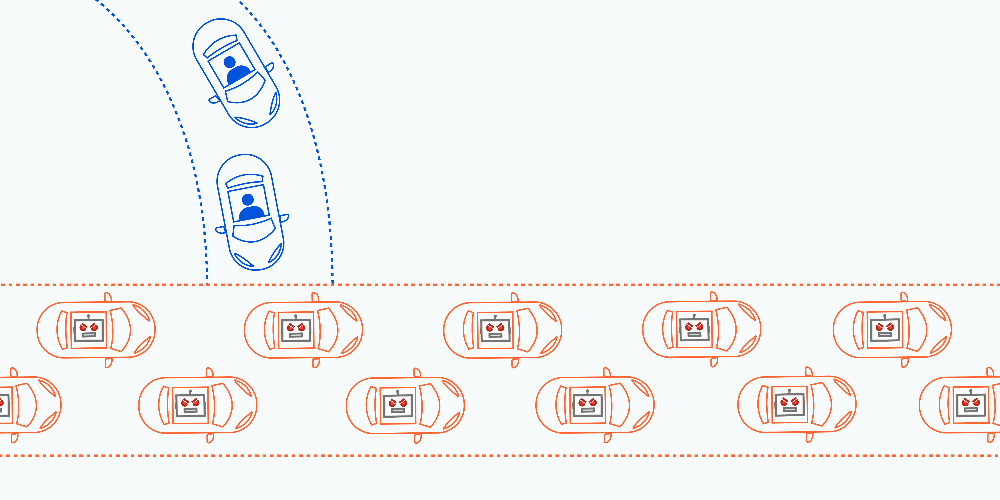

Nesta terça-feira dia 16 de Dezembro, houve filas intermináveis no controlo de fronteiras do aeroporto de Lisboa devido a problemas com os serviços informáticos.
De acordo com a ministra da Administração interna, o servidor "pifou" (video [aqui](https://cnnportugal.iol.pt/videos/sistema-pifou-por-momentos-ministra-explica-longas-filas-no-aeroporto-de-lisboa/6942abde0cf255913376360f)).

Por mais espetacular que seja este completíssimo relatório técnico por parte da ministra, creio que podemos aprofundar um bocadinho.

## O Sistema que falhou - EES

Está a ser implementado um novo sistema de controlo de fronteiras pela União Europeia - Sistema de Entradas e saídas (ou EES - Entry/Exit System), para passageiros que venham fora da zona Schengen. Este sistema está a ser implementado em fases pelos vários países europeus com prazo final até Abril de 2026. Começou a ser implementado a 12 de Outubro de 2025.

A 10 de Dezembro de 2025 (portanto a quarta feira da semana passada) foi implementada uma nova fase para recolha de fotografias e dados biométricos para estes passageiros. Este controlo estava a ser efetuado de maneira razoavelmente lenta, com o auxílio de funcionários do aeroporto e de agentes da PSP.

Numa tentativa de acelerar o processo, na passada segunda feira dia 15 (dia antes do incidente) foram desbloqueados os quiosques de self service para a aquisição destes dados biométricos. Todos estes quiosques acedem a um mesmo servidor, aparentemente alojado no Ministério de Administração Interna. De acordo com as declarações da Ministra, as terças-feiras de madrugada e de manhã são as alturas em que o aeroporto tem maior afluencia de passageiros provenientes de fora da zona euro. Por este motivo, nesta manhã de terça feira dia 16 (imediatamente depois de terem desbloqueado os quiosques), a utilização desses quiosques aumentou exponencialmente e a quantidade de acessos ao servidor também - e este claramente não estava pronto para aguentar com todos estes pedidos simultâneos.

Portanto o servidor "pifou" por não aguentar com este volume súbito de acessos. Curiosamente, isto é muito semelhante a um conhecido ataque informático chamado [DDoS](https://www.cloudflare.com/learning/ddos/what-is-a-ddos-attack/). Podem imaginar isto como um uma estrada à hora de ponta:

  

Quando estão a tentar entrar na estrada mas já está completamente cheia é muito difícil. E quanto mais pessoas entram, menos aquilo anda.

Quando é de facto um ataque informático, os utilizadores que estão na estrada são bots, que acedem em massa para prevenir que utilizadores legítimos entrem na estrada. Isto causa lentidão no acesso aos serviços ou previne o acesso completamente porque o serviço "pifa" por esgotar os recursos de hardware.

Nesta situação do aeroporto, foram todos utilizadores legítimos, mas a estrada (o servidor) não estava preparada para levar com tantos carros, portanto é como se tivesse sido um ataque informático autoinfligido.

Quando isto acontece, existem dois passos para resolução imediata:

1- Fazer restart ao servidor para restaurar o serviço ao estado saudável (removendo todos os "carros" da estrada) - por vezes há mecanismos que fazem este restart automático sem ser necessária intervenção manual

2- Controlar a afluencia de utilizadores, limitando o número de acessos para que o sistema não volte a "pifar"

Sendo que desbloquearam os quiosques e toda a gente conseguia utiliza-los, mitigar o tráfego e portanto resolver o ponto 2 parece muito complicado. Além de que não acredito que se tenha comunicado qual era o problema, pelo que ninguém sabe que devem parar de fazer estes acessos pelos quiosques. A unica solução aqui é voltar ao processo em que existe alguém a controlar estes acessos individualmente para que os passageiros não tentem todos aceder em simultaneo. Portanto, existe fila maior para os acessos à estrada (neste caso filas no aeroporto), mas vão ser processadas mais rápido porque a estrada não fica entupida nem há acidentes.

## Isto vai pifar outra vez antes do Natal?

Já antes de desbloquearem os quiosques, havia relatos da lentidão dos serviços. Antes de dia 10 de Dezembro haveria de ser por falta de pessoal e desde 10 de Dezembro esse problema há de ter sido combinado com este mesmo problema de tráfego, mas numa escala menor e mais controlada, visto que não havia quiosques disponíveis.

Para resolver isto agora na altura do Natal há duas possíveis soluções:

1- abdicar dos quiosques completamente e confiar nos agentes da PSP para gerirem esta situação - funcionará mas o acesso continuará lento devido à lentidão dos serviços e claro, à falta de automação dos processos (e talvez falta de pessoal?)

2- Voltar ao sistema anterior e não recolher estes dados biométricos até se aumentar os recursos do servidor. Isto é a melhor solução mas implementá-la poderá necessitar de autorização Europeia e não só Nacional.

## E os outros aeroportos do mundo?

Isto está a ser implementado em 29 países da União Europeia. Mas como vimos, o servidor estava alojado no *nosso* Ministério de Administração Interna. Portanto, embora seja uma regra Europeia, a implementação é feita a nível nacional. Pelo que sim pode acontecer noutros países, mas partir cá não significa que pifamos a União Europeia toda.

## Como é que isto resolve? E quem resolve?

Estão a dividir a culpa entre os agentes da PSP responsáveis pelo controlo de fronteiras, misturado com a ANA aeroportos e as empresas privadas que contrataram para configurar estes serviços.

Se isto foi de facto um problema de carga do servidor, é necessário reavaliar os recursos de hardware (memória e CPU) para que este consiga suportar este volume de pedidos, especialmente numa altura critica como o Natal.

Para isto não se ter resolvido mais rápido, é porque faltam recursos humanos - quer para gerir o servidor na altura crítica, como para gerir as pessoas e os acessos no aeroporto em si. Existe também o problema de as pessoas não saberem que era este excesso de trafego que estava a partir o servidor, e portanto continuavam a tentar até ao infinito, o que há de ter agravado o problema. É preciso também establecer melhores canais de comunicação pois não interessa haver pessoas a prevenir problemas nos aeroportos se não sabem que problemas estão a combater.

Para já, parece me responsabilidade do Ministério da Administração Interna alocar todos estes recursos e coordenar estes esforços. Mas estes processos demoram, portanto é esperar que consigam mitigar até passar a altura crítica das festas.

No entretanto, desejo um Feliz Natal a todos! 🎄 E boa sorte aos que viajam 🍀

### Mais referências
- https://eco.sapo.pt/2025/12/16/temos-esperas-medias-de-tres-horas-e-maximas-de-seis-horas-no-aeroporto-de-lisboa-reconhece-ministra/
- https://observador.pt/2025/12/16/problemas-tecnicos-no-controlo-de-fronteiras-provocam-horas-de-espera-no-aeroporto-de-lisboa/
- EES https://travel-europe.europa.eu/ees/faq#what-does-ees-do
- A quem não se aplica o ESS: https://travel-europe.europa.eu/pt/ees/to-whom-does-ees-not-apply

